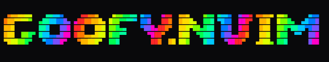

A silly plugin to enhance your Neovim experience with ASCII art animation feedback for commands.

> **Requires Neovim 0.10+.**

## Overview

Goofy adds fun ASCII animations that trigger when you run configured commands. Save a file? Get a cool animation. Run a test? Why not celebrate with some ASCII art?

### Features

- Multiple trigger types: commands, autocmd events, and filetypes
- Keyframe and swipe animation strategies (plus an extensible strategy registry)
- Sequential animation chains with configurable delays between animations
- Per-buffer filetype animations (no repeat-firing on every `FileType` event)
- Floating-window positioning with multibyte-aware width calculation
- Public API for triggering animations programmatically
- `:checkhealth goofy` integration

## Installation

### [lazy.nvim](https://github.com/folke/lazy.nvim)

```lua
{
  "itreau/goofy.nvim",
  config = function()
    require("goofy").setup({
      animations = {
        write = {
          command = "w",
          animation = "write",
        },
      },
    })
  end,
}
```

### [packer.nvim](https://github.com/wbthomason/packer.nvim)

```lua
use({
  "itreau/goofy.nvim",
  config = function()
    require("goofy").setup({
      animations = {
        write = {
          command = "w",
          animation = "write",
        },
      },
    })
  end,
})
```

## Configuration

### Setup

```lua
require("goofy").setup({
  window = {
    border = "rounded",
    position = "bottom_right",  -- see "Window Positions" below
    width = nil,                -- auto-calculated if nil (multibyte-aware)
    height = nil,               -- auto-calculated if nil
    color = nil,                -- highlight group (e.g., "String", "Error")
  },
  animation = {
    delay = 30,                 -- default frame delay in ms
    loop = false,               -- whether to loop animations
    sequence_delay = 0,         -- default delay between sequential animations in ms
  },
  animations = {
    -- your animation registrations here (see below)
  },
})
```

#### Window Positions

`window.position` accepts any of: `top_left`, `top_center`, `top_right`, `center`,
`left_center`, `right_center`, `bottom_left`, `bottom_center`, `bottom_right`.
An unknown value logs a warning and falls back to `bottom_right`.

### Registering Animations

Animations can be triggered by:

#### Commands

```lua
animations = {
  write = {
    command = "w",              -- creates proxy :Goofyw that runs :w then fires the animation
    animation = "write",        -- name of a file under lua/goofy/animations/
  },
  quit = {
    command = "q",
    animation = "cool_glasses",
  },
}
```

Proxy commands forward `bang`, `range`, `count`, and `args` to the underlying command,
so `:Goofyw!`, `:'<,'>Goofyw`, `:Goofyw foo.txt` all work as you'd expect. Duplicate
proxy names log a warning (the last registration wins).

#### Autocmd Events

```lua
animations = {
  save_event = {
    trigger = "BufWritePost",
    animation = "write",
  },
}
```

#### Filetypes

```lua
animations = {
  lua_files = {
    filetype = "lua",
    animation = "cool_glasses",
    once = true,                -- optional (default true): fire once per buffer
  },
}
```

By default filetype animations fire **once per buffer** (so opening multiple lua files
won't spam `cool_glasses` on every `FileType` re-entry). Set `once = false` to fire on
every `FileType` trigger. The per-buffer mark is cleared on `BufDelete`.

### Sequential Animations

You can chain multiple animations to play sequentially by providing an array of animation names:

```lua
animations = {
  celebrate_save = {
    command = "wq",
    animation = {"write", "cool_glasses"},  -- plays in sequence
    delay = 100,  -- optional delay between animations in ms
  },
  test_success = {
    trigger = "BufWritePost",
    animation = {"write", "fire_meme"},
    delay = 150,  -- ms between animations
  },
}
```

Each animation in the sequence:

- Plays in order after the previous animation completes
- Uses its own window settings (position, color, etc.)
- Can have a configurable delay between animations via the `delay` option
- If `delay` is not specified, defaults to `sequence_delay` from config (0ms by default)

### Concurrency

Multiple animations are allowed to play concurrently (their floating windows stack on
screen). This is intentional so animations triggered from different parts of the screen
don't suppress one another.

## Animation Strategies

Goofy supports multiple animation strategies. Each strategy defines how the animation is played.

### Keyframe Strategy (Default)

The keyframe strategy plays through a sequence of frames, displaying each for a set duration. This is the default strategy if no `type` is specified.

```lua
-- lua/goofy/animations/my_keyframe.lua
return {
  type = "keyframe",  -- optional, this is the default
  delay = 200,        -- milliseconds between frames
  frames = {
    { "Frame 1", "Line 2" },
    { "Frame 2", "Line 2" },
    { "Frame 3", "Line 2" },
  },
  opts = {
    color = "String",
    position = "center",
    width = 20,
    height = 5,
  },
}
```

#### Heredoc Format (block text)

```lua
return {
  delay = 500,
  frames = {
    [[
  ___
 /   \
|  W  |
 \___/
    ]],
    [[
  ___
 /   \
|  !  |
 \___/
    ]],
  },
  opts = {
    color = "WarningMsg",
    position = "center",
  },
}
```

### Swipe Strategy

The swipe strategy moves a single frame across the screen in a specified direction until it swipes off-screen.

```lua
-- lua/goofy/animations/my_swipe.lua
return {
  type = "swipe",
  direction = "left",     -- "left", "right", "up", or "down"
  duration = 500,         -- total swipe duration in milliseconds
  frames = {
    [[
  ___
 /   \
|  W  |
 \___/
    ]],
  },
  opts = {
    color = "String",
    position = "center",
  },
}
```

#### Swipe Options

| Option      | Type   | Required | Description                                               |
| ----------- | ------ | -------- | --------------------------------------------------------- |
| `type`      | string | Yes      | Must be `"swipe"`                                         |
| `direction` | string | Yes      | Direction to swipe: `"left"`, `"right"`, `"up"`, `"down"` |
| `duration`  | number | Yes      | Total duration of the swipe animation in milliseconds     |
| `frames`    | table  | Yes      | Single frame to animate (array with one element)          |
| `opts`      | table  | No       | Window options (color, position, width, height)           |

`direction` semantics (content **exits** in that direction):

- `"left"`  - content slides left (the trailing edge vanishes off the left)
- `"right"` - content slides right
- `"up"`    - content slides up (top line drops off, empty appends at bottom)
- `"down"`  - content slides down (bottom line drops off, empty prepends on top)

### Custom Strategies

You can register your own strategy module at runtime via
`require("goofy.engine.animator").register_strategy(name, mod)`. The module must expose
a `play(anim, global_opts, on_complete)` function; an optional `validate(anim)` function
will be called before `play`. This is how the built-in `keyframe` and `swipe` strategies
are themselves registered.

## How It Works

1. **Setup**: Call `require("goofy").setup()` with your configuration
2. **Registration**: Goofy creates proxy commands (e.g., `:Goofyw`) that:
   - Execute the original command (forwarding `bang`, `range`, `count`, `args`)
   - Trigger the associated animation
3. **Animation**: A floating window displays the ASCII animation using the specified strategy

## Public API

Trigger animations programmatically (e.g. after tests pass, from an LSP handler):

```lua
local goofy = require("goofy")

-- play a single animation
goofy.play("write")

-- fire accepts a single name or a sequence; opts is shared by both branches
goofy.fire({ "write", "cool_glasses" }, { delay = 100, opts = { position = "center" } })

-- play_sequence is the lower-level sequence driver (same signature as fire's table branch)
goofy.play_sequence({ "write", "cool_glasses" }, { delay = 100 })
```

The `opts` table has two fields used internally:

| Key    | Type   | Description                                              |
| ------ | ------ | -------------------------------------------------------- |
| `delay` | number | Delay in ms between animations in a sequence (default 0) |
| `opts` | table  | Window/animation opts passed through to the strategy     |

## Health Checks

Run `:checkhealth goofy` to verify:

- Neovim version is 0.10+
- Built-in strategies (`keyframe`, `swipe`) are registered
- Animations are discoverable on the runtimepath
- No duplicate proxy commands in your config

## Available Animations

- `write` - Simple "Saving..." animation
- `cool_glasses` - Cool glasses ASCII art
- `fire_meme` - Fire meme ASCII art
- `write_banner` - Large "Write" banner swipe animation
- Add your own in `lua/goofy/animations/`!

## Contributing

We welcome contributions! While users can create their own custom animations, we're building a standard library of fun ASCII animations that everyone can enjoy.

### Ways to Contribute

1. **New Animations** - Add creative ASCII animations to `lua/goofy/animations/`
2. **Bug Fixes** - Help squash those bugs
3. **Documentation** - Improve docs and examples
4. **Feature Requests** - Share your ideas for new animation strategies or triggers

### Contributing Animations

To contribute a new animation:

1. Create a new file in `lua/goofy/animations/`
2. Use one of the supported strategies (keyframe or swipe)
3. Test it works with your Neovim setup
4. Submit a PR with a description and preview (gif/screenshot appreciated!)

We especially welcome:

- Seasonal animations (holidays, events)
- Programming-themed ASCII art
- Fun reactions (success, error, celebration)
- Minimal, elegant animations

## License

MIT
